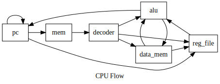

# dCPU

diohabara's CPU, or dCPU

## Environment

- OS: `Ubuntu 18.04.3 LTS`
- Assembly: `RISC-V`
- FPGA: `NEXYS`
- Vivado:  `v2019.1.3 (64-bit)`

## Overview



## Test

Type this command

```sh
bin/test.sh
```

and type the component below you would like to test

- `alu`
- `decoder`

is available

## Folder description

- `img`
  - includes images
- `src`
  - includes source files
- `test`
  - includes test bench files
- `bin`
  - includes shell scripts

## referrences

- For RISC-V
  - <https://riscv.org/>
- For CPU
  - JPN
    - <https://toshiba.semicon-storage.com/jp/design-support/e-learning/micro_intro/>
  - ENG
    - <https://wwang.github.io/teaching/CS5513_Spr19/lectures/Base_CPU_Implementation.pdf>

## note

- [note in JPN](https://hackmd.io/_mzHwoncRbicxOlpW_OqbQ)
